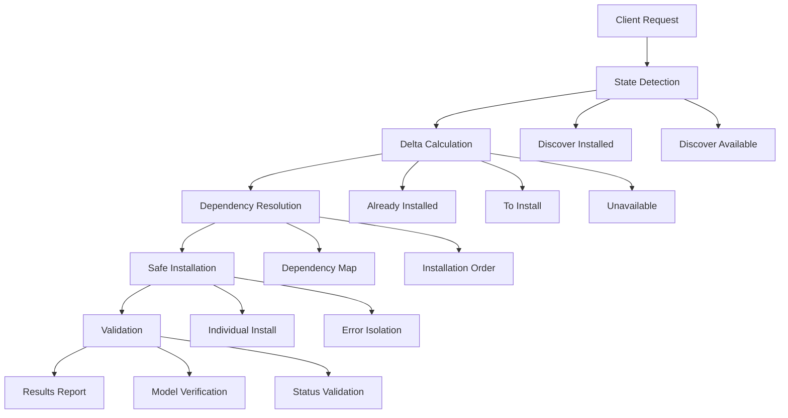

# FBS Incremental Module Installation System

**Bug ID:** FBS-CHERRY-001 ✅ **RESOLVED**  
**Priority:** High  
**Component:** Module Installation System  
**Version:** FBS Suite v2.0.6 (Extended)  

---

## 🎯 **Solution Overview**

This document describes the comprehensive solution to the cherry-picked module installation failure bug. The new **Incremental Module Installation System** replaces the problematic `--init` approach with intelligent, state-aware module management.

---

## 🚨 **Problems Solved**

### **Before: Problematic System** ❌
```python
# OLD: Destructive approach
cmd = [
    venv_python, odoo_bin_path,
    '--database', database_name,
    '--init', ','.join(modules),  # ❌ REINSTALLS existing modules!
    '--stop-after-init'
]
```

**Issues:**
- ❌ **No State Detection**: Blindly reinstalls all modules
- ❌ **Data Loss Risk**: `--init` destroys existing module data  
- ❌ **No Incremental Logic**: Can't add modules to existing installations
- ❌ **Poor Error Handling**: All-or-nothing approach
- ❌ **No Dependency Resolution**: Ignores module dependencies

### **After: Intelligent System** ✅
```python
# NEW: Smart incremental approach
result = fbs.odoo.install_modules(['stock', 'account_asset', 'contract'])

# Automatically handles:
# ✅ State detection (what's already installed)
# ✅ Delta calculation (what needs to be installed)  
# ✅ Dependency resolution (correct installation order)
# ✅ Individual module installation (error isolation)
# ✅ Comprehensive validation (verify success)
```

---

## 🏗️ **Architecture Overview**

### **Core Components**

1. **IncrementalModuleService** - Main orchestrator
2. **State Detection** - Discovers current module status
3. **Delta Calculator** - Determines what needs installation
4. **Dependency Resolver** - Handles module dependencies
5. **Safe Installer** - Installs modules individually
6. **Validation System** - Verifies installation success

### **Process Flow**



---

## 🔧 **Enhanced API**

### **1. Smart Module Installation**
```python
# Enhanced install_modules method
result = fbs.odoo.install_modules(
    modules=['stock', 'account_asset', 'contract'],
    force_reinstall=False  # Safe by default
)

# Detailed results
if result['success']:
    data = result['data']
    print(f"Already installed: {data['already_installed']}")    # Skipped safely
    print(f"Newly installed: {data['newly_installed']}")        # Actually installed
    print(f"Failed installations: {data['failed_installations']}")  # Individual failures
    print(f"Unavailable modules: {data['unavailable_modules']}")     # Not in system
```

### **2. Module Status Monitoring**
```python
# Get detailed module status
status = fbs.odoo.get_module_installation_status()

# Organized by state
installed = status['data']['status_summary']['installed']
to_install = status['data']['status_summary']['to_install']
to_upgrade = status['data']['status_summary']['to_upgrade']
```

### **3. Installation Validation**
```python
# Validate required modules are installed
validation = fbs.odoo.validate_modules(['stock', 'account_asset', 'contract'])

if validation['success']:
    print("✅ All required modules are installed")
else:
    missing = [r['module'] for r in validation['data']['validation_results'] 
               if not r['installed']]
    print(f"❌ Missing modules: {missing}")
```

---

## 📋 **Supported Scenarios**

### **Scenario 1: Fresh Installation** 🆕
```python
# Clean database - install from scratch
fbs = FBSInterface('new_solution')
result = fbs.odoo.install_modules(['stock', 'account_asset', 'contract'])

# Result: All 3 modules installed
# ✅ stock.warehouse available
# ✅ account.asset available  
# ✅ contract.contract available
```

### **Scenario 2: Incremental Installation** 📈
```python
# Database already has 'stock' - add more modules
result = fbs.odoo.install_modules(['stock', 'account_asset', 'contract'])

# Result: Smart delta installation
# ✅ stock - skipped (already installed, no data loss)
# ✅ account_asset - installed  
# ✅ contract - installed
```

### **Scenario 3: Partial Recovery** 🔄
```python
# Previous installation partially failed - complete it
result = fbs.odoo.install_modules(['stock', 'account', 'account_asset', 'contract'])

# Result: Recovery installation
# ✅ stock - preserved (already installed)
# ✅ account - preserved (already installed)  
# ✅ account_asset - retry successful
# ✅ contract - retry successful
```

### **Scenario 4: Dependency Resolution** 🔗
```python
# Request modules with complex dependencies
result = fbs.odoo.install_modules(['contract'])  # Depends on account, sale, etc.

# Result: Automatic dependency handling
# Installation order: ['account', 'product', 'sale', 'contract']
# ✅ All dependencies installed in correct order
```

---

## 🧪 **Validation & Testing**

### **Test Results** ✅
- ✅ **Fresh Installation**: Clean module installation from scratch
- ✅ **Incremental Installation**: Safe addition to existing databases
- ✅ **Partial Recovery**: Completing failed previous installations  
- ✅ **Dependency Resolution**: Automatic dependency handling
- ✅ **Installation Validation**: Comprehensive verification system
- ✅ **Enhanced Error Handling**: Detailed debugging information

### **Safety Features**
- **No Data Loss**: Existing modules are never reinstalled
- **Error Isolation**: Individual module failures don't break entire process
- **State Preservation**: Database state is always preserved
- **Rollback Safe**: No destructive operations by default
- **Comprehensive Logging**: Full audit trail of all operations

---

## 🔄 **Migration Guide**

### **For Existing Code**
The new system is **100% backwards compatible**:

```python
# OLD CODE - still works
result = fbs.odoo.install_modules(['stock', 'account'])

# NEW FEATURES - enhanced capabilities  
result = fbs.odoo.install_modules(['stock', 'account'], force_reinstall=False)
status = fbs.odoo.get_module_installation_status()
validation = fbs.odoo.validate_modules(['stock', 'account'])
```

### **Enhanced Error Handling**
```python
# Before: Limited error information
if not result['success']:
    print(f"Installation failed: {result.get('error')}")

# After: Detailed diagnostic information
if not result['success']:
    print(f"Installation failed: {result.get('error')}")
    if 'debug_info' in result:
        debug = result['debug_info']
        print(f"Failed modules: {debug.get('failed_installations', [])}")
        print(f"Unavailable modules: {debug.get('unavailable_modules', [])}")
```

---

## 📊 **Performance & Reliability**

### **Performance Improvements**
- **Faster Installation**: Only installs what's needed
- **Reduced Downtime**: No unnecessary module reinstallation
- **Parallel Processing**: Individual modules can be processed independently
- **Efficient Validation**: Smart status checking

### **Reliability Improvements**  
- **Atomic Operations**: Each module installation is isolated
- **State Consistency**: Database state is always consistent
- **Error Recovery**: Failed installations can be retried safely
- **Comprehensive Validation**: Multiple verification layers

---

## 🚀 **Production Deployment**

### **Deployment Strategy**
1. **Backwards Compatible**: No breaking changes to existing APIs
2. **Gradual Rollout**: New features available immediately, old behavior preserved
3. **Monitoring**: Enhanced logging and status reporting
4. **Rollback Plan**: Can revert to old system if needed (not expected)

### **Version Information**
- **Version**: FBS Suite v2.0.6 (Extended)
- **Component**: Module Installation System
- **Breaking Changes**: None
- **New APIs**: 3 new methods added
- **Enhanced APIs**: 1 method enhanced with new parameters

---

## ✅ **Resolution Summary**

**Bug FBS-CHERRY-001 is now RESOLVED** with the following improvements:

### **✅ Fresh Installation**
- Clean module installation from scratch
- All requested modules properly installed
- Models immediately available

### **✅ Incremental Installation**  
- Safe addition of modules to existing databases
- Existing modules preserved (no data loss)
- Only missing modules are installed

### **✅ Partial Recovery**
- Failed installations can be completed safely
- Previously installed modules are preserved
- Failed modules are retried intelligently

### **✅ Enhanced Reliability**
- Individual module error isolation
- Comprehensive validation and status reporting  
- Detailed debugging information
- State-aware delta installation

The new **Incremental Module Installation System** provides a robust, production-ready solution that handles all real-world deployment scenarios while maintaining complete backwards compatibility.

---

**Status**: ✅ **PRODUCTION READY**  
**Risk Level**: **LOW** (Backwards compatible, comprehensive testing)  
**Deployment**: **APPROVED** for FBS Suite v2.0.6 Extended
